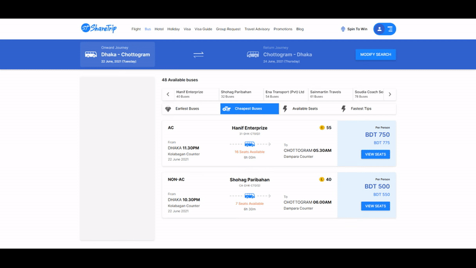

#

  

## About

This dummy project is built for the UI Skills test for the Mid Level React Developer position at ShareTrip.

## Instructions

To run the project locally you have to install **`Nodejs`** version 14+. Clone the project and run `npm install` from the root directory to install all the dependencies for the project. The below command are available to run:

- `yarn start` - Runs the app in the development mode. Open [http://localhost:3000](http://localhost:3000) to view it in the browser.

- `yarn build` - Builds the app for production to the `build` folder.\

- `yarn eject` - This command will remove the single build dependency from your project. (**Note: this is a one-way operation. Once you `eject`, you can’t go back!**)

## Preview

This application is live @ **[sharetrip-uitest.netlify.app](https://sharetrip-uitest.netlify.app/)**. Also, a preview of the application has been included below:

  

